# Manual De Usuario
**UNIVERSIDAD DE SAN CARLOS DE GUATEMALA**  
**FACULTAD DE INGENIERÍA**  
**PRIMER PROYECTO - MANEJO E IMPLEMENTACIÓN DE ARCHIVOS**  
**CATEDRÁTICO: ING. WILLIAM ESCOBAR**  
**TUTOR ACADÉMICO: DANIEL MELLADO**

**NOMBRE DEL ESTUDIANTE: ** Javier Andrés Velásquez Bonilla 
**CARNÉ:** 202307775 
**SECCIÓN:** A-  

**GUATEMALA, [11/09/2025]**

# **OBJETIVOS DEL SISTEMA** 

## **GENERAL** 

El objetivo de este manual es proporcionar una guía clara y accesible para que cualquier usuario pueda utilizar ExtreamFS, un sistema que simula el funcionamiento de un sistema de archivos EXT2, permitiéndole comprender conceptos avanzados de almacenamiento de datos de manera intuitiva y visual.

## **ESPECÍFICOS**

1. Guiar paso a paso en el uso de la interfaz web de ExtreamFS, mostrando cómo ejecutar comandos, cargar scripts y visualizar los resultados de operaciones en el sistema de archivos.
2. Explicar el significado de los diferentes reportes visuales generados por el sistema y cómo interpretarlos para comprender mejor el funcionamiento interno de un sistema de archivos.
3. Proporcionar soluciones a los problemas más comunes que pueden surgir durante el uso de la aplicación, facilitando una experiencia fluida para usuarios de todos los niveles.

# **INTRODUCCIÓN** 

Este manual está diseñado para guiar a cualquier persona interesada en el funcionamiento de sistemas de archivos, especialmente estudiantes y profesionales de informática. ExtreamFS es una aplicación web que simula un sistema de archivos EXT2, permitiéndole crear discos virtuales, particiones, formatear sistemas de archivos, y gestionar archivos y carpetas, todo mediante una interfaz intuitiva.

A diferencia de trabajar con sistemas reales, ExtreamFS le permite experimentar sin riesgo de dañar su equipo, visualizando en tiempo real cómo se organizan internamente los datos en un disco.

Este manual cubre los siguientes temas:

* Cómo crear y gestionar discos virtuales y particiones  
* Ejecución de comandos para manipular el sistema de archivos  
* Carga y ejecución de scripts para automatizar operaciones  
* Visualización e interpretación de los diferentes reportes gráficos  
* Solución de problemas comunes durante la operación del sistema

# **INFORMACIÓN DEL SISTEMA**

ExtreamFS funciona como una aplicación web con una interfaz sencilla que le permite interactuar con un sistema de archivos simulado. El flujo básico de uso es el siguiente:

1. **Entrada de comandos**: La aplicación presenta un área de texto donde puede escribir comandos (como `mkdisk`, `fdisk`, `mount`) para realizar operaciones en el sistema de archivos virtual.

2. **Ejecución y procesamiento**: Al enviar los comandos, el sistema los procesa en el backend y ejecuta las operaciones correspondientes, creando archivos virtuales, particiones o manipulando el sistema de archivos según lo solicitado.

3. **Visualización de resultados**: Después de cada operación, el sistema muestra mensajes de éxito o error, permitiéndole saber si la operación se completó correctamente.

4. **Generación de reportes gráficos**: Mediante el comando `rep`, puede generar visualizaciones que muestran la estructura interna del sistema: particiones, inodos, bloques, árboles de directorios y más, lo que facilita la comprensión de cómo funciona un sistema de archivos real.

# **REQUISITOS DEL SISTEMA**

Para utilizar ExtreamFS cómodamente, necesita:

* **Navegador web moderno**: Chrome, Firefox, Edge o Safari en sus versiones recientes.
* **Conexión a Internet**: Para acceder a la aplicación web si está alojada en un servidor remoto.
* **Resolución de pantalla**: Mínimo 1366x768 para una visualización óptima de los reportes gráficos.

No necesita instalar software adicional, ya que todo el procesamiento se realiza en el servidor. En caso de utilizar la versión local:

* **Sistema Operativo**: Windows, macOS o Linux.
* **Go**: Versión 1.18 o superior (para el backend).
* **Node.js**: Versión 14.0 o superior (para el frontend).
* **Graphviz**: Instalación completa para la generación de reportes

# **FLUJO DE LAS FUNCIONALIDADES DEL SISTEMA** 

Esta sección le guiará a través de un ejemplo completo de uso de ExtreamFS, mostrando cada paso del proceso desde la creación de discos hasta la generación de reportes. Para cada operación, se incluyen los comandos exactos que debe ejecutar y capturas de pantalla del resultado.

## **1. Creación de un Disco Virtual**

El primer paso es crear un disco virtual donde almacenaremos nuestro sistema de archivos.

**Comando:** mkdisk -size=10 -path=/tmp/Disco1.mia -name=Disco1

**Explicación:** Este comando crea un disco virtual de 10 MB llamado "Disco1.mia" en la carpeta "/tmp".

**Resultado esperado:** El sistema confirmará la creación exitosa del disco.

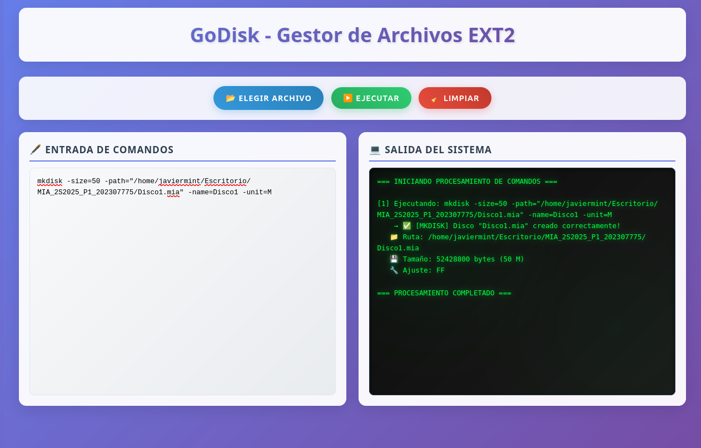

## **2. Creación de Particiones**

Una vez creado el disco, podemos dividirlo en particiones para organizar mejor nuestros datos.

**Comandos:**

- Crear una partición primaria
fdisk -size=3 -path=/tmp/Disco1.mia -name=Part1 -type=P

- Crear una partición extendida
fdisk -size=5 -path=/tmp/Disco1.mia -name=Part2 -type=E

- Crear una partición lógica dentro de la extendida
fdisk -size=2 -path=/tmp/Disco1.mia -name=Part3 -type=L

**Explicación:** Estos comandos crean tres particiones diferentes: una primaria de 3 MB, una extendida de 5 MB, y una lógica de 2 MB dentro de la partición extendida.

**Resultado esperado:** El sistema confirmará la creación exitosa de cada partición.

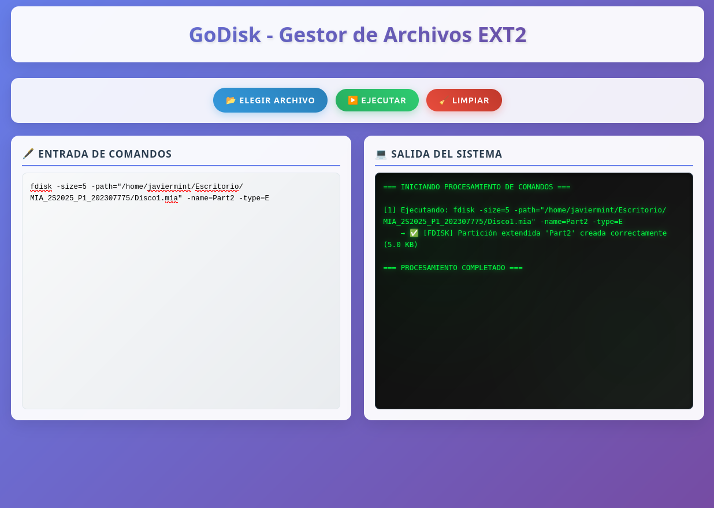

## **3. Montaje de Particiones**

Para poder utilizar las particiones, debemos montarlas en el sistema.

**Comandos:**

- Montar la partición primaria
  - mount -path=/tmp/Disco1.mia -name=Part1

- Montar la partición lógica
  - mount -path=/tmp/Disco1.mia -name=Part3

**Explicación:** Estos comandos montan las particiones "Part1" y "Part3" en el sistema, asignándoles identificadores únicos.

**Resultado esperado:** El sistema mostrará los identificadores asignados a las particiones montadas (por ejemplo, "751A" y "752A").

## **4. Formateo del Sistema de Archivos**

Ahora formatearemos la partición primaria con un sistema de archivos EXT2.

**Comando:** mkfs -id=751A -type=full -fs=2fs

**Explicación:** Este comando formatea la partición identificada como "751A" (su ID puede variar) con un sistema de archivos EXT2, creando todas las estructuras necesarias (SuperBloque, bitmaps, inodos, etc.).

**Resultado esperado:** Confirmación del formateo exitoso.

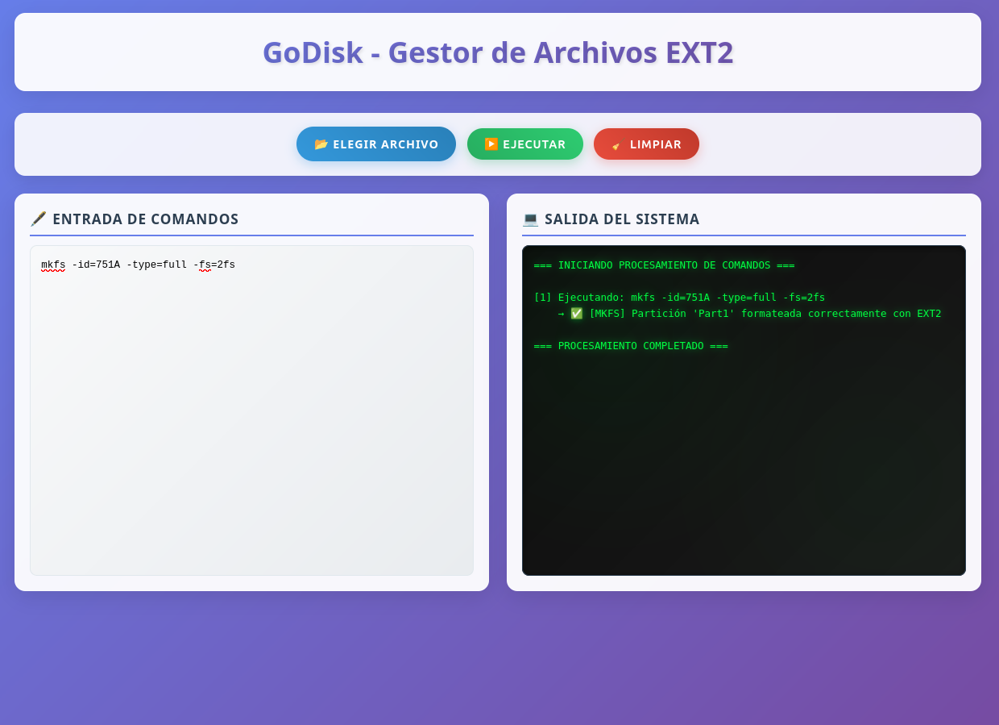

## **5. Gestión de Usuarios**

Para gestionar archivos y carpetas, primero debemos iniciar sesión y crear usuarios.

**Comandos:**

- Iniciar sesión como administrador
  - login -user=root -pass=123 -id=751A

- Crear un nuevo grupo
  - mkgrp -name=usuarios

- Crear un nuevo usuario
  - mkusr -user=usuario1 -pass=123 -grp=usuarios

**Explicación:** Estos comandos inician sesión como el usuario root (creado automáticamente durante el formateo), crean un nuevo grupo llamado "usuarios" y añaden un usuario llamado "usuario1" a ese grupo.

**Resultado esperado:** Confirmación de inicio de sesión y creación exitosa de grupo y usuario.

## **6. Creación de Directorios y Archivos**

Ahora crearemos algunos directorios y archivos en nuestro sistema.

**Comandos:**

- Crear estructura de directorios
  - mkdir -path=/home/usuario1/documentos -p

- Crear un archivo con contenido
  - mkfile -path=/home/usuario1/documentos/archivo1.txt -size=4 -cont="/home/usuario1/Documentos/MIA_2025/Contenido.txt"

**Explicación:** El primer comando crea la estructura de directorios "/home/usuario1/documentos" (la bandera -p crea los directorios padres si no existen). El segundo comando crea un archivo de texto con contenido específico.

**Resultado esperado:** Confirmación de la creación exitosa de directorios y archivos.

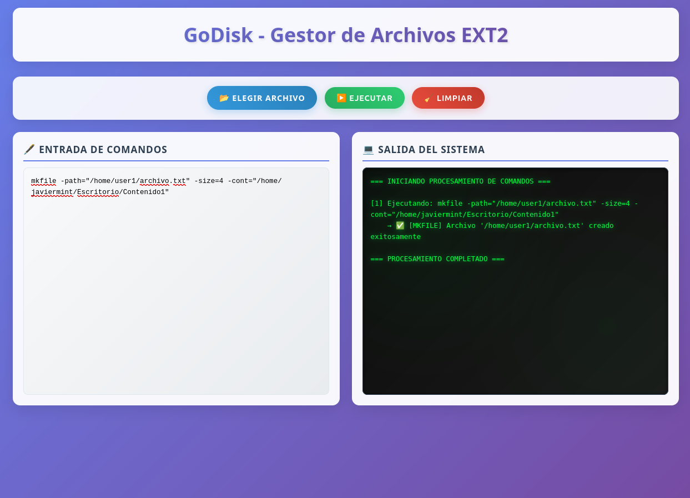

## **7. Visualización del Contenido de Archivos**

Podemos visualizar el contenido de los archivos creados.

**Comando:** cat -file1=/home/usuario1/documentos/archivo1.txt

**Explicación:** Este comando muestra el contenido del archivo especificado.

**Resultado esperado:** El sistema mostrará el texto contenido en el archivo.

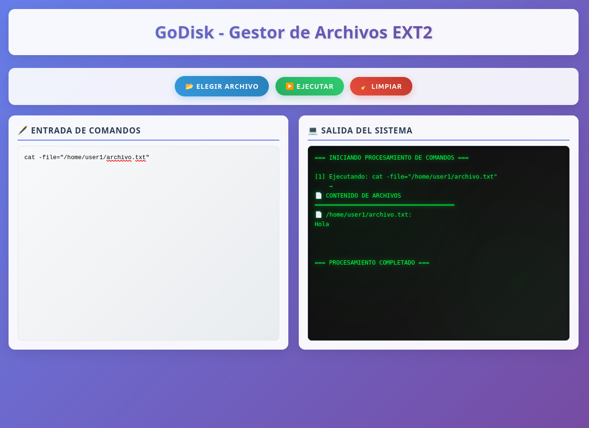

## **8. Generación de Reportes**

Finalmente, generaremos diversos reportes para visualizar las estructuras internas del sistema.

**Comandos:**

- Reporte del MBR
  - rep -id=751A -path=/tmp/reporte_mbr.jpg -name=mbr

- Reporte del disco
  - rep -id=751A -path=/tmp/reporte_disk.jpg -name=disk

- Reporte de inodos
  - rep -id=751A -path=/tmp/reporte_inodo.jpg -name=inode

- Reporte de bloques
  - rep -id=751A -path=/tmp/reporte_block.jpg -name=block

- Reporte del árbol de directorios
  - rep -id=751A -path=/tmp/reporte_tree.jpg -name=tree

- Reporte del listado de archivos en un directorio
  - rep -id=751A -path=/tmp/reporte_ls.jpg -path_file_ls=/home/usuario1 -name=ls

**Explicación:** Estos comandos generan diferentes tipos de reportes visuales que muestran la estructura interna del sistema de archivos.

**Resultado esperado:** El sistema confirmará la generación de cada reporte y los archivos estarán disponibles en la ruta especificada.

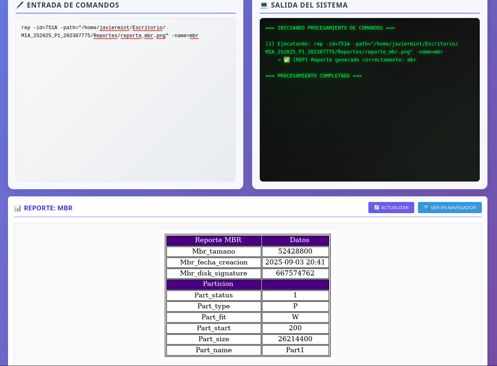

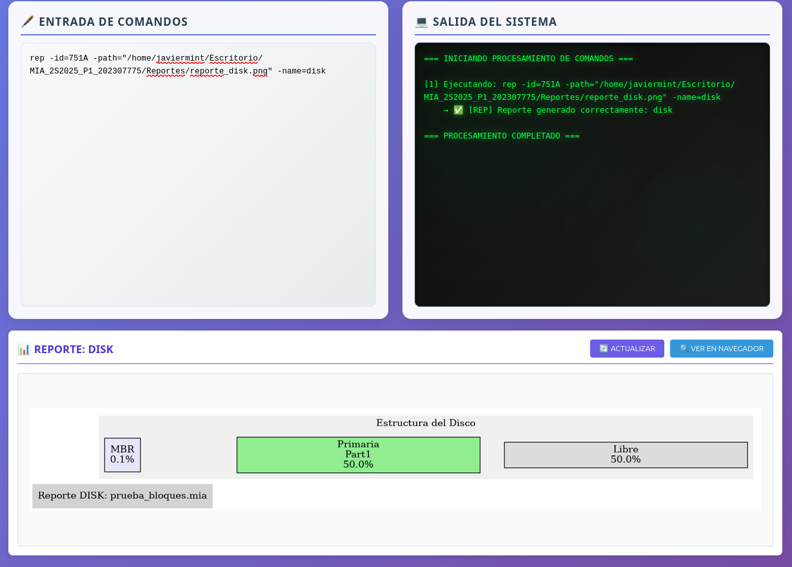

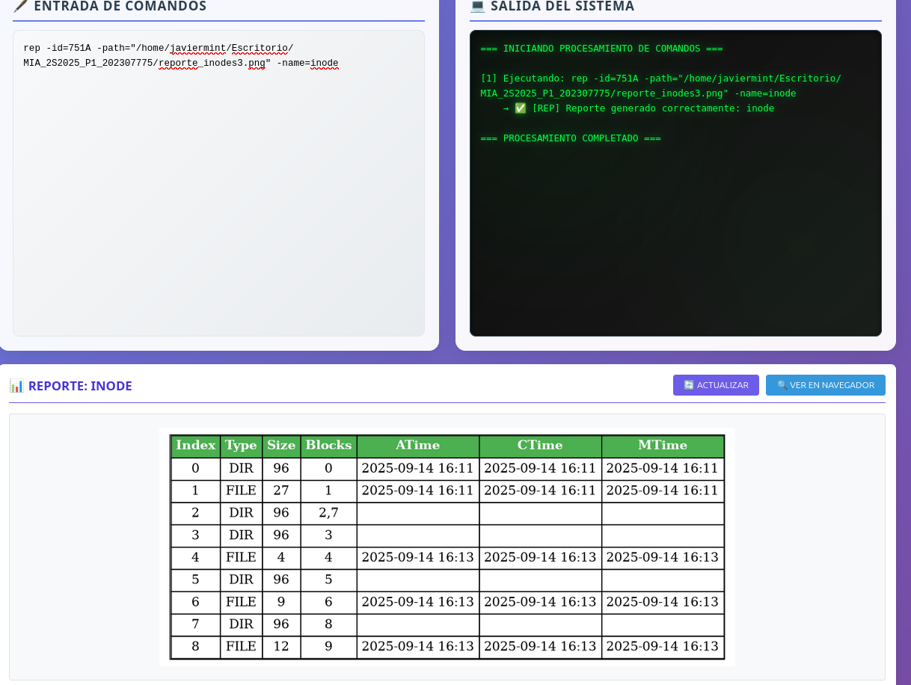

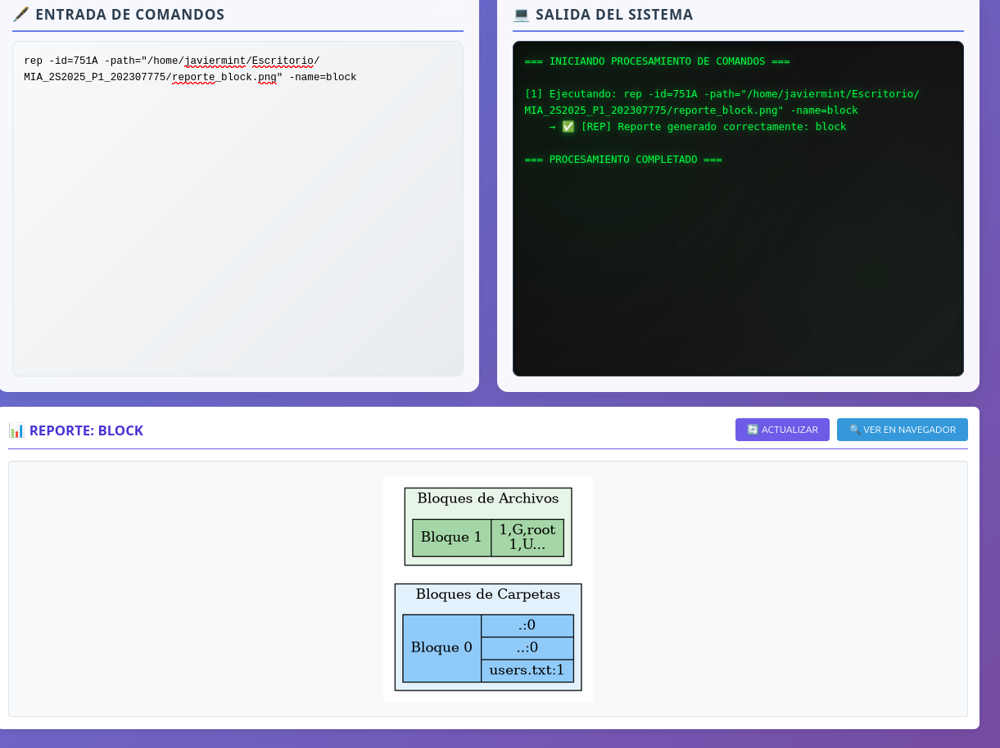

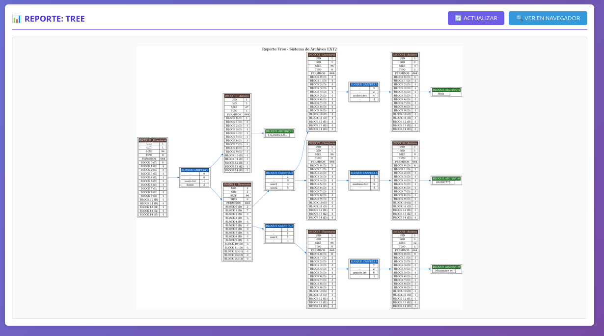

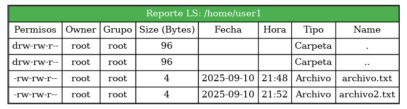

## **9. Cierre de Sesión**

Para finalizar, cerramos la sesión del usuario actual.

**Comando:** logout

**Explicación:** Este comando cierra la sesión del usuario actualmente activo.

**Resultado esperado:** Confirmación de cierre de sesión exitoso.

## **10. Desmontaje y Eliminación de Discos (Opcional)**

Si desea limpiar el sistema, puede desmontar particiones y eliminar discos.

**Comandos:**

- Eliminar el disco
  - rmdisk -path=/tmp/Disco1.mia

**Explicación:** Este comando elimina el archivo del disco virtual.

**Resultado esperado:** Confirmación de la eliminación exitosos.

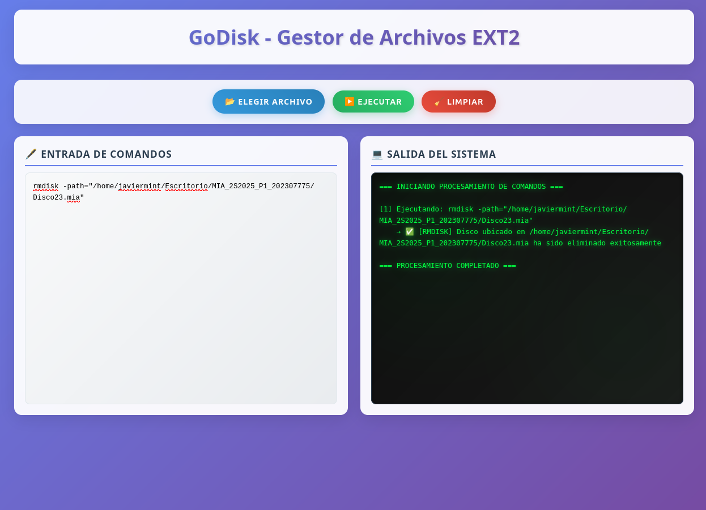

# **SOLUCIÓN DE PROBLEMAS COMUNES**

A continuación, se presentan algunos problemas comunes que puede encontrar al usar ExtreamFS y cómo solucionarlos:

## **Error: "Disco no encontrado"**

**Problema:** Al intentar crear una partición o montar un disco, recibe un mensaje de error indicando que el disco no existe.

**Solución:** Verifique que la ruta al archivo del disco sea correcta y que el disco haya sido creado previamente con el comando `mkdisk`.

## **Error: "Partición no encontrada"**

**Problema:** Al intentar montar una partición, recibe un mensaje de error indicando que la partición no existe.

**Solución:** Asegúrese de que el nombre de la partición sea correcto y que la partición haya sido creada previamente con el comando `fdisk`.

## **Error: "No hay sesión activa"**

**Problema:** Al intentar ejecutar comandos que requieren permisos (como `mkdir`, `mkfile`), recibe un error indicando que no hay una sesión activa.

**Solución:** Inicie sesión con el comando `login` antes de ejecutar estos comandos.

## **Error: "Permisos insuficientes"**

**Problema:** Al intentar crear o modificar archivos, recibe un error de permisos insuficientes.

**Solución:** Asegúrese de estar trabajando en un directorio donde su usuario tenga permisos de escritura, o inicie sesión como administrador (`root`).

## **Error en la generación de reportes**

**Problema:** Los reportes no se generan correctamente o aparecen vacíos.

**Solución:** Verifique que la partición esté montada, que el ID sea correcto, y que Graphviz esté correctamente instalado en su sistema si está ejecutando la